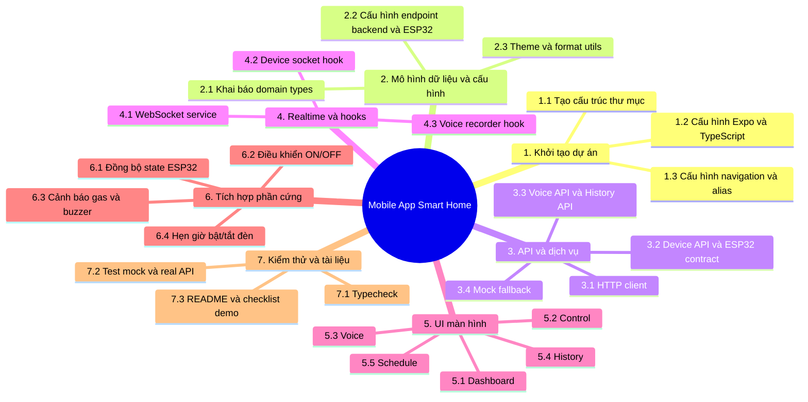

# WBS - Mobile App Smart Home Voice Control

Tài liệu này mô tả phạm vi công việc của phần mobile app trong dự án Smart Home. Kế hoạch giả lập theo 2 tuần để dễ chia tiến độ, demo và bàn giao.

## 1. Cấu Trúc WBS

## 2. Kế Hoạch 2 Tuần

| Ngày | Giai đoạn | Công việc chính | Kết quả mong đợi |
| --- | --- | --- | --- |
| Ngày 1 | Khởi tạo | Dựng project, cấu hình Expo, TypeScript, navigation | App chạy được khung cơ bản |
| Ngày 2 | Dữ liệu | Tạo types, env, theme, format utils | Có model dữ liệu rõ ràng |
| Ngày 3 | API backend | HTTP client, voice API, history API | Kết nối backend AI/history |
| Ngày 4 | API ESP32 | Device API, contract adapter, mock fallback | Đọc state và điều khiển ESP32 |
| Ngày 5 | Realtime | WebSocket service, hooks realtime | Nhận update live từ ESP32 |
| Ngày 6 | Dashboard | Hiển thị cảm biến, trạng thái thiết bị | Dashboard dùng được |
| Ngày 7 | Control | UI điều khiển ON/OFF, đồng bộ trạng thái | Bấm nút điều khiển thiết bị |
| Ngày 8 | Voice | Ghi âm, gửi file, hiển thị kết quả | Demo voice flow cơ bản |
| Ngày 9 | History | Hiển thị lịch sử điều khiển | Xem lại thao tác đã thực hiện |
| Ngày 10 | Schedule | Thêm hẹn giờ bật/tắt đèn | Có lịch 05:00, 06:00, 18:00, 22:00 |
| Ngày 11 | Cảnh báo | Gas vượt ngưỡng, popup cảnh báo | Nhận cảnh báo nguy hiểm |
| Ngày 12 | Hoàn thiện UI | Căn chỉnh bố cục, thống nhất style | Giao diện ổn định hơn |
| Ngày 13 | Kiểm thử | Test mock/real, fix lỗi runtime | Ổn định luồng chính |
| Ngày 14 | Tài liệu/demo | README, checklist demo, cấu trúc repo | Sẵn sàng trình bày |

## 3. Phân Rã Theo Module

### 3.1 Khởi Tạo

- Cấu trúc thư mục.
- Cấu hình Expo.
- Cấu hình TypeScript strict mode.
- Cấu hình alias `@/*`.

### 3.2 Dữ Liệu Và Hợp Đồng

- Khai báo types thiết bị, cảm biến, lịch sử.
- Định nghĩa contract ESP32.
- Chuẩn hóa room/device/action.
- Cấu hình endpoint backend và ESP32.

### 3.3 API

- Backend voice upload.
- Backend history fetch.
- ESP32 state fetch.
- ESP32 control command.
- Mock fallback khi chưa có môi trường thật.

### 3.4 Realtime

- WebSocket nhận cập nhật state.
- Subscribe/unsubscribe listener.
- Tự reconnect khi mất kết nối.

### 3.5 UI

- Dashboard: nhiệt độ, độ ẩm, gas, trạng thái thiết bị.
- Control: ON/OFF theo phòng.
- Voice: ghi âm và xử lý lệnh.
- History: lịch sử thao tác.
- Schedule: bật/tắt lịch đèn, chạy thử lịch.

### 3.6 Tích Hợp Phần Cứng

- Đồng bộ IP ESP32.
- Đồng bộ WebSocket port.
- Kiểm tra buzzer và gas warning.
- Kiểm tra lệnh điều khiển nhiều đèn cùng lúc.

### 3.7 Kiểm Thử Và Bàn Giao

- `npm run typecheck`.
- Test REST `/state`, `/control`.
- Test WebSocket `ws://<esp-ip>:81`.
- Test demo trên thiết bị thật.
- Chuẩn hóa README và docs.

## 4. Ưu Tiên Demo

1. Dashboard và Control.
2. ESP32 state/control thật.
3. Schedule bật/tắt đèn.
4. Cảnh báo gas.
5. Voice và History.

## 5. Mốc Bàn Giao

- Cuối ngày 7: điều khiển và dashboard cơ bản ổn định.
- Cuối ngày 11: có cảnh báo gas, realtime và schedule.
- Cuối ngày 14: có tài liệu, checklist và kịch bản demo hoàn chỉnh.
